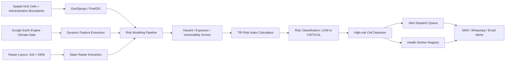
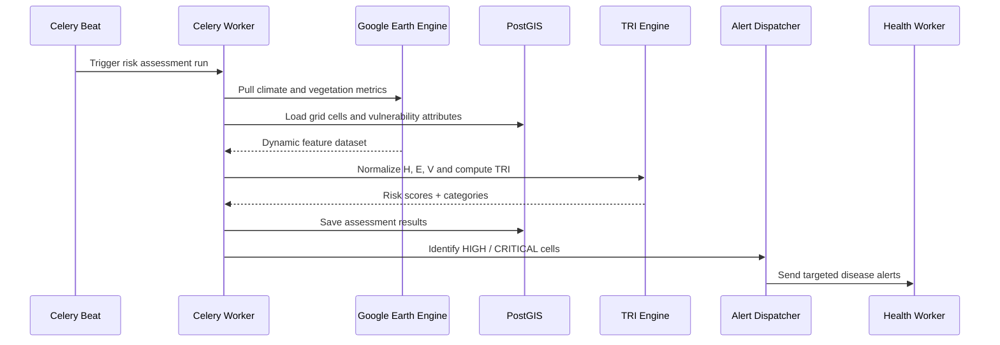
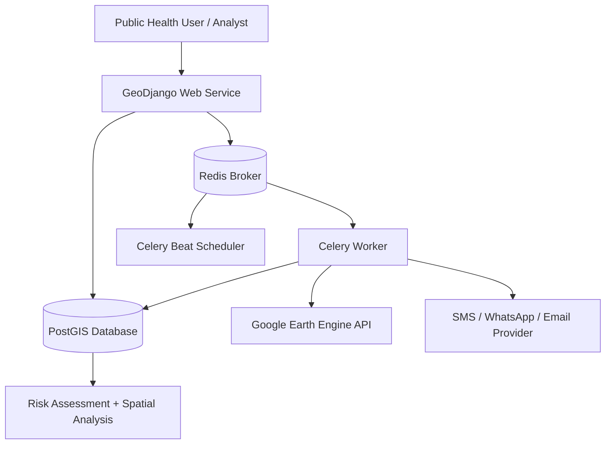

# GeoAfya

Developer: Henry Mwoha

GeoAfya is a spatial epidemiology and decision-support platform designed to detect and prioritize disease risk in vulnerable communities, with a particular focus on kala-azar (visceral leishmaniasis) in refugee and movement corridors. The application combines satellite-derived environmental indicators, demographic vulnerability, health access data, and operational alerting to identify high-risk geographic cells before outbreaks widen.

The project is built as a Django + GeoDjango application with PostGIS, Google Earth Engine integration, vectorized risk scoring, and Celery-based alert dispatch. It is meant to help public health teams, NGOs, and field health workers act earlier and more efficiently in high-risk refugee environments.

---

## Why kala-azar matters in refugee corridors

Kala-azar, also known as visceral leishmaniasis, remains one of the most dangerous neglected tropical diseases in fragile and mobile populations. In refugee corridors and settlement zones, the disease risk is amplified by a combination of:

- overcrowded shelters and informal settlements
- poor housing conditions and limited vector control
- limited access to diagnostic services and treatment centers
- malnutrition and weakened immune resistance
- population mobility across border and camp routes
- environmental conditions that support sandfly breeding and survival

These conditions make refugee corridors especially vulnerable because they are not just geographic routes; they are epidemiological pressure points. A person moving through or settling in an exposed corridor may become part of a chain of infection that is difficult to detect early without spatial intelligence.

This is the core public-health problem that GeoAfya addresses: identifying where transmission risk and service gaps overlap so health actors can intervene before cases rise.

---

## The public-health problem this project is trying to solve

Traditional disease surveillance often reacts late. It may detect cases only after transmission is already established, especially in mobile populations. In refugee contexts, public health teams face several major problems:

1. Geographic fragmentation: risk is spread across large, shifting movement corridors.
2. Data scarcity: routine case data may be incomplete, delayed, or inconsistent.
3. Environmental complexity: climate, soil, vegetation, and settlement patterns influence vector ecology.
4. Service inequity: some communities are farther from clinics and less likely to receive prompt care.
5. Operational delays: alerts are often not tied to a spatially prioritized action plan.

GeoAfya is designed to close that gap by creating a risk-lens map of the region and linking it to operational workflows for health workers and response teams.

---

## Solution overview

GeoAfya turns spatial, environmental, and vulnerability data into a ranked risk model for each grid cell. Each cell can be evaluated based on:

- hazard: climate and ecological conditions that favor vector survival and transmission
- exposure: population density and settlement proximity
- vulnerability: poverty, malnutrition, and travel time to care
- healthcare deficit: how weak the local service system is relative to demand

The platform then computes a composite risk score and assigns a risk level such as LOW, MODERATE, HIGH, or CRITICAL. Cells with elevated risk can be linked to health workers and alert dispatch workflows so action is triggered quickly.

This is particularly relevant for kala-azar because the disease is often spatially clustered and highly sensitive to environmental and social drivers. Early risk identification allows intervention before vector activity becomes clinically obvious.

---

## Technical architecture

The app is structured around a modular GeoDjango architecture that treats disease surveillance as a spatial analytics problem.

### System architecture overview



### Operational workflow diagram



### Deployment architecture



### 1. Core platform

- Django: application framework and orchestration layer
- GeoDjango: geospatial models and PostGIS integration
- PostGIS: storage and querying of spatial boundaries, grid cells, and region assignments

The main spatial data model is defined around grid cells and administrative regions, which makes it possible to evaluate risk at small geographic units rather than only at broad district levels.

### 2. Spatial representation and epidemiology model

The project models the surveillance area as a standardized grid of spatial cells, each containing fields such as:

- cell ID and geometry
- district and region metadata
- poverty rate
- malnutrition rate
- health travel time
- population density
- settlement distance
- healthcare deficit

This is implemented in the model layer using the grid and regional tables in the base app. These cells are the foundation for all downstream scoring and alerting.

### 3. Environmental and climate ingestion

The system ingests multiple data streams:

- Google Earth Engine datasets for climate and vegetation signals
- CHIRPS precipitation data
- MODIS land surface temperature and NDVI
- raster-based static layers such as soil and elevation data

This is handled through the GEE ingestion layer, which extracts data over each spatial cell and aggregates values per time window. The design is important because kala-azar risk does not come from a single indicator; it emerges from the interaction between climate, land conditions, and human vulnerability.

### 4. Risk model

The app calculates risk using a Triangle Risk Index (TRI)-style framework. The design uses normalized component vectors:

- H = Hazard
- E = Exposure
- V = Vulnerability

The basic multiplicative score is:

$$
TRI_{raw} = H \times E \times V
$$

Then the system applies a healthcare-deficit saturation adjustment to reflect the reality that high risk is amplified when health-system capacity is weak:

$$
TRI_{final} = TRI_{raw} \times (1 + amplification)
$$

where the amplification term is shaped by a logistic function dependent on healthcare deficit. This is a practical modeling decision: when health access is poor, the same environmental risk can translate into worse outbreak potential and slower response.

### 5. Alerting and operational action

The platform includes a worker registry and dispatch log system for health professionals. When a cell is classified as HIGH or CRITICAL, it can trigger alert creation for assigned health workers. This allows the system to connect risk intelligence to field action rather than leaving the output as an analysis-only dashboard.

Dispatch channels include:

- SMS
- WhatsApp
- email

The alert log records which worker received the message, which risk score triggered the alert, and whether the notification was sent successfully.

### 6. Background processing and scheduling

The project uses Celery with Redis in the deployment stack for asynchronous processing. This is essential because environmental extraction, vector computation, and alert generation may be expensive and should not block the request lifecycle.

The main services in the project include:

- PostGIS database
- Redis broker
- Django web service
- Celery worker
- Celery Beat scheduler

This design allows the system to run risk-model updates on a periodic schedule while keeping the app responsive.

---

## Key files and their role

The repository is organized around a small but powerful set of modules:

- `base/models.py`: spatial, risk, and dispatch data models
- `base/gee.py`: Earth Engine data ingestion and zonal extraction
- `base/scalers.py`: robust normalization and AHP-based weighting
- `base/tri.py`: vectorized risk scoring and classification engine
- `base/tasks.py`: orchestration pipeline for end-to-end assessment and alert generation
- `docker-compose.yml`: deployment of database, Redis, web app, and workers

This separation makes the project easy to reason about: ingest data, normalize it, score it, then act on the results.

---

## End-to-end workflow

1. Spatial grid cells are loaded into PostGIS.
2. The system extracts dynamic climate variables from Google Earth Engine.
3. Static rasters such as soil and elevation are processed per grid cell.
4. The data are normalized using robust scaling and AHP weights.
5. Hazard, exposure, and vulnerability components are combined into a TRI score.
6. Cells are assigned risk categories.
7. High-risk cells trigger alert creation for assigned field personnel.
8. The system records assessment and dispatch results for operational follow-up.

This workflow is important for kala-azar response, since the disease often emerges in a patchwork of ecological and social conditions rather than uniformly across a whole district.

---

## How this helps fight kala-azar in refugee settings

The platform is not just a dashboard; it is meant to support operational decision-making in fragile public-health contexts.

### Early warning

By translating environmental, social, and health access data into a risk score, the system helps teams identify hotspot cells before case numbers are high. This is crucial for kala-azar because vector ecology and human mobility can change quickly, especially when people are displaced.

### Targeted intervention

Rather than responding broadly, the system can prioritize specific cells or regions where the risk is highest. That allows response teams to focus on:

- vector control activities
- active case search
- referral coordination
- community health outreach
- mobile clinic scheduling

### Operational support for field teams

The health-worker registry and alerting system gives response leaders a way to notify the right personnel about the right risk zone at the right time. In refugee corridors, this can reduce delays between detection and action.

### Better resource allocation

When health infrastructure is limited, the platform helps show where healthcare deficit, travel time, and vulnerability combine into severe risk. This improves allocation of scarce resources, whether that means diagnostics, treatment support, or engagement teams.

---

## Local setup

### Prerequisites

- Python 3.11+
- PostgreSQL/PostGIS
- Redis
- Docker and Docker Compose (recommended)

### Option 1: Docker Compose

```bash
docker-compose up --build
```

This starts the database, Redis, Django web service, Celery worker, and Celery Beat scheduler.

### Option 2: Local Python environment

```bash
python -m venv .venv
source .venv/bin/activate
pip install -r requirements.txt
python manage.py migrate
python manage.py runserver
```

### Environment variables

Configure the database and operational settings using environment variables such as:

- `DATABASE_URL`
- `REDIS_URL`
- `DJANGO_SETTINGS_MODULE`
- `GEE_SERVICE_ACCOUNT`
- `GEE_KEY_FILE_PATH`
- `TWILIO_ACCOUNT_SID`
- `TWILIO_AUTH_TOKEN`
- `TWILIO_FROM_NUMBER`
- `DEFAULT_FROM_EMAIL`

---

## Running the risk pipeline

The system is designed to run periodic assessment jobs through Celery tasks. The orchestration layer loads environmental indicators, stages them, normalizes them, computes TRI scores, persists the outputs, and dispatches alerts for elevated risk zones.

This makes the project useful not only as a static model, but as an operational epidemiology workflow.

---

## Strategic impact

GeoAfya is designed to support a shift from reactive outbreak response to proactive risk management in fragile and mobile settings. In refugee corridors, where kala-azar risks are shaped by both biological and social factors, this is especially important.

The project contributes by:

- mapping transmission risk in vulnerable geographic cells
- identifying health access gaps that amplify disease burden
- supporting earlier intervention by field teams
- strengthening data-driven public-health planning for displaced populations

In short, GeoAfya links disease ecology, spatial vulnerability, and operational decision-making in a single system.

---

## Project vision

The long-term ambition is to evolve GeoAfya into a practical early-warning and intervention platform for vector-borne diseases in humanitarian settings. The system is built around the idea that disease control works best when environmental intelligence, social vulnerability, and field action are connected in one operating loop.

For kala-azar in refugee corridors, that may mean the difference between late emergency response and timely, targeted action that saves lives.

---

## License

This project is intended for public-health research and operational decision support. Please check the repository license and deployment policy before using it in production or humanitarian operations.
